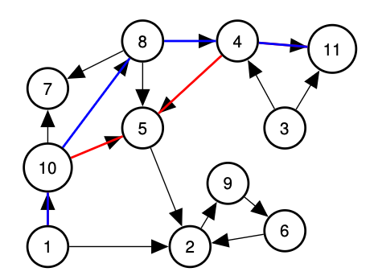

# 3. Induction

## Principle of Induction

$$P(0) \land (\forall n \in N ) P(n) \implies P(n + 1)$$

Then we get:

$$( \forall n \in N) P(n)$$.

“But aren’t you starting with the statement to prove the statement?”

In general, ∀n ∈N P(n) ̸≡P(n + 1).

“P(n)” is “different” statement than “P(n + 1)” <mark style="color:$danger;">for any fixed n</mark>.

## Two color theorem: example.

Any map formed by dividing the plane into regions by drawing straight lines can be properly colored with two colors.

<figure><figcaption></figcaption></figure>

Fact: Swapping red and blue gives another valid colors.

### Base Case.

1\. Add line.

2\. Get inherited color for split regions

3\. <mark style="color:$danger;">Switch on one side</mark> of new line.(Fixes conflicts along line, and makes no new ones.)

Algorithm gives $$P(k) \implies P(k + 1)$$.


This induction process give out an algorithm, to color the map, which is very important in algorithm design in computer science.This is recursion.


## Strenthening Induction Hypothesis

<mark style="color:$danger;">Assume more to make the prove more powerful.</mark>

**Theorem: The sum of the first n odd numbers is a perfect square.**

<mark style="color:$success;">Theorem: The sum of the first n odd numbers is</mark> $$n^2$$

k th odd number is 2(k−1) + 1.

Base Case 1 (first odd number) is 12

Induction Hypothesis Sum of first k odds is perfect square a2 = k 2

Induction Step 1. The (k + 1)st odd number is 2k + 1.

2\. Sum of the first k + 1 odds is

a2 + 2k + 1= k 2 + 2k + 1

3\. k 2 + 2k + 1= (k + 1)2

... P(k+1)!

you want to prove some therom, and it does not work out, maybe you want to prove a slighter stronger therom.

With the stronger therom, then you can use the stronger statement as your induction hypothethys, to help you build up a proof.

## Tiling Cory Hall Courtyard.

<figure><figcaption></figcaption></figure>

## Strong Induction

Theorem: Every natural number n > 1 can be written as a (possibly trivial) product of primes.

Definition: A prime n has exactly 2 factors 1 and n.

**Base Case**: n = 2.

**Induction Step**:

P(n) =“n can be written as a product of primes. “Either n + 1 is a prime or n + 1= a·b where 1 < a, b < n + 1.

P(n) says nothing about a, b!

### Strong Induction Principle:

<mark style="color:$success;">If</mark> $$P(0)$$ and $$(\forall k \in N)((P(0)  \land . . . \land P(k ))  \implies P(k + 1))$$,

<mark style="color:$success;">then</mark> $$(\forall k \in N)(P(k ))$$.

&#x20;P(0) ⇒P(1) ⇒P(2) ⇒P(3) ⇒···

### Strong induction hypothesis:&#x20;

“a and b are products of primes” ⇒ “n + 1= a·b = (factorization of a (factorization of b)”

n + 1 can be written as the product of the prime factors!

## <mark style="color:$danger;">Well Ordering Principle</mark> and Induction.

If (∀n)P(n) is not true, then (∃n)¬P(n). (find one case which does not fit)

Consider smallest m, with¬P(m), m ≥0

P(m−1) ⇒P(m) must be false (assuming P(0) holds.)

This is a proof of the induction principle!

I.e., (¬∀n)P(n) ⇒ ((∃n)¬(P(n−1) ⇒P(n)).

Not all n, P(n) is true. Which means there exists n, P(n-1) ⇒ P(n) is not true.

(<mark style="color:$success;">Contrapositive of Induction principle</mark> (assuming P(0))

$$P(0) \land (\forall n \in N ) P(n) \implies P(n + 1)$$ ⇒ $$( \forall n \in N) P(n)$$

$$P(0) \land (\forall n ) P(n) \implies P(n + 1)$$ ⇒ $$( \forall n) P(n)$$

Contrapositive (Use Analogous laws):

&#x20;$$\lnot  (( \forall n) P(n))$$ ⇒ $$\lnot (P(0) \land (\forall n ) P(n) \implies P(n + 1))$$

&#x20;$$( \exists n) \lnot P(n)$$ ⇒ $$\lnot P(0) \lor (\exists n ) \lnot (P(n) \implies P(n + 1))$$

<mark style="color:$danger;">It assumes that there is a smallest m where P(m) does not hold.</mark>

<mark style="color:blue;">The Well ordering principle states that for any subset of the natural numbers there is a smallest element.</mark>

Smallest may not be what you expect: the well ordering principal

holds for rationals but with different ordering!!

E.g. Reduced form is “smallest” representation of rational number a/b.


**数学归纳法** 依赖于 N的良序性：

* 证明“若命题 P(n) 对 n=0 成立，且 P(k) 成立可推出 P(k+1)成立，则 P(n)对所有 n∈N 成立”时，本质是利用了 N 的子集若无反例，必有最小反例的矛盾。


<mark style="color:$info;">Think of the first smallest counter example and prove that it can't exsit.</mark>

<mark style="color:$info;">It is another phrasing of induction,</mark>

When you want to prove something by induction, you can use regular induction, strong induction, and go up. But you can also say, look <mark style="color:$primary;">there is no smallest counter example, therefore it must be true for everything</mark>. And you get to use the word SMALLEST, that very powerful.

## Example:

Thm: All natural numbers are interesting.

0 is interesting...

Let n be the first uninteresting number.

But n−1 is interesting and n is uninteresting,

so n is the first uninteresting number.

But being first is interesting!

Thus, there is no smallest uninteresting natural number.

Thus: All natural numbers are interesting.

