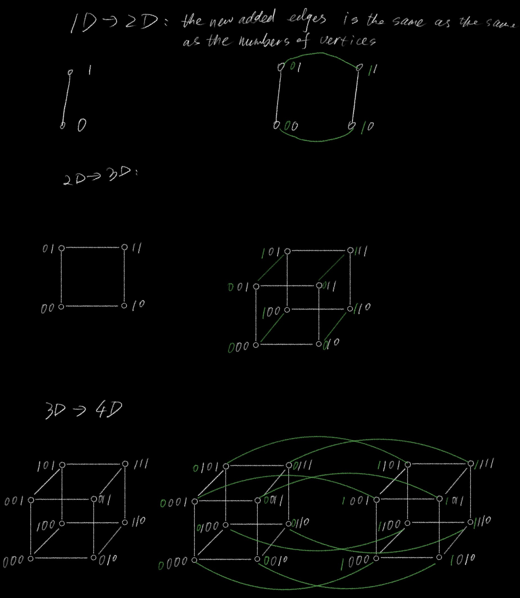

# 6. More Graphs

## Planarity and Euler

<figure><figcaption></figcaption></figure>

These graphs cannot be drawn in the plane <mark style="color:$warning;">without edge crossings</mark>.

**Euler’s Formula:** $$v + f= e + 2$$ for any connected planar drawing.

* For <mark style="color:$warning;">complete</mark> simple planar graphs: $$e ≤3v−6$$ .
  * Idea: Face is a cycle in graph of length 3.
  * Count face-edge incidences to “eliminate” $$f$$ .
* For <mark style="color:$warning;">bipartite</mark> simple planar graphs: $$e ≤2v−4$$ .
  * Idea: face is a cycle in graph of length 4.
  * Count face-edge incidences.

## Tree.

A tree is a connected acyclic graph.

<figure><figcaption></figcaption></figure>

Vertices/Edges. Notice: e = v−1 for tree.

One face for trees!

Euler’s Formula: v + f= e + 2 for any connected planar drawing.

Euler works for trees: v + f= e + 2.

v + 1= v−1+ 2

## Euler’s formula.

**Euler:** <mark style="color:$warning;">Connected planar</mark> graph has $$v + f= e + 2$$.

<mark style="color:$danger;">**Proof:**</mark> <mark style="color:$danger;"></mark><mark style="color:$danger;">Induction on</mark> $$e$$<mark style="color:$danger;">.</mark>

**Base:** $$e = 0$$, $$v = f= 1$$. (Just one vetex because all vetices must be connected, and face is the infinite face)

**Induction Hypothesis:** <mark style="color:$warning;">For all connected planar graph with less then</mark> $$e$$ <mark style="color:$warning;">edges, euler equation holds.</mark>

**Induction Step: (Conneted graph with** $$v$$ **vertices and**  $$e$$ edge&#x73;**)**

* If it is a tree. Done. (v = e + 1, f = 1, then v + f = e + 2)
* If not a tree.
  * <mark style="color:$warning;">Find a cycle</mark>. Remove an edge will joins two faces.
  * **New graph:** $$v$$ vertices, $$e−1$$ edges, $$f−1$$ faces, Planar.
  * $$v + (f−1) = (e−1) + 2$$ by induction hypothesis.
  * Therefore $$v + f= e + 2$$.

<figure><figcaption></figcaption></figure>


1, Because we are induction on e, then the hypothesis should be:

For a connected graph with e edges, it has v + f = e + 2?

and the induction should be:

for e+1 connected planar graph...

The key ideal is <mark style="color:$warning;">always trying to subtract one from something, and this time we are choosing</mark> $$e$$. the upper induction should also work.

2, Could we induction on v?

&#x20;Yes, but induction on e is easier with simpler conditions to take into consideration. We need to choose a vetex carefully, it is very difficult to find, and make the induction misserable. Based on deepseek answers, induction on e is easy, induction on f is hard, and induction on v is stupid.


## Graph Coloring.

Given $$G = (V , E)$$, a coloring of $$G$$ assigns colors to vertices $$V$$ where for each edge the endpoints have different colors.

<figure><figcaption></figcaption></figure>

Notice that the last one has only three colors.

Fewer colors than number of vertices.

<mark style="color:blue;">**Lemma:**</mark> Any graph with <mark style="color:$warning;">maximum degree</mark> $$d$$ can be $$d + 1$$ colored.

**Proof:** <mark style="color:$danger;">Induction on</mark> $$n$$ <mark style="color:$danger;">(Number of vertices)</mark>

**Base case:** True for 1 vertex.&#x20;

**Hypothesis:** Color a graph with less than $$n$$ vertex, and maximum degree $$d$$ can be $$d+1$$ colored.

**Induction Step:**&#x20;

Color $$n$$ vertex graph with $$d + 1$$ colors?

Remove vertex $$v$$.

Color remaining graph with $$d + 1$$ colors by induction hypothesis.

Set of neighbors of $$v$$ use at most $$d$$ colors, <mark style="color:$warning;">one color is available for</mark> $$v$$<mark style="color:$warning;">.</mark>

<mark style="color:$danger;">BUT Last graph:</mark> Fewer colors than max degree node.

## Planar graphs and maps.

Planar graph coloring ≡ map coloring.

Four color theorem is about planar graphs!

<figure><figcaption></figcaption></figure>

## Six color theorem.

**Theorem:** <mark style="color:$success;">Every planar graph can be colored with six colors</mark>.

<mark style="color:blue;">**Proof:**</mark>

**Recall:** $$e ≤3v−6$$ for any planar graph where $$v > 2$$ (Planar Graph). From Euler’s Formula.

**Base Cases:** for $$v \leq 6$$ can be colored with 6

**Induction Hypothesis:** Every planar graph with vetices less than $$v (v \geq 6)$$ can be colored with six colors.

**Induction Steps:**

* Total degree: $$2e$$
* Average degree:=$$\frac {2e} {v} \leq \frac {2(3v-6)} {v} \leq 6-\frac {12} {v}$$

<mark style="color:$warning;">There exists a vertex</mark> $$v$$ <mark style="color:$warning;">with degree < 6 or at most 5. (if not, then average degree will larger or equal than 5, which is not agree with average degree value)</mark>

* One vetex less:
  * Remove vertex $$v$$ of degree at most 5.
  * <mark style="color:$danger;">One vetex less graph could be colored with 6 colors by induction hypothesis.</mark>
* One color is available for $$v$$ since only five neighbors and only five colors are used.
* Then planar graph with $$v$$ vertices can be colored with 6 colors.


You can see the progress  as program

You know you can <mark style="color:$success;">find a vetex with degree 5</mark>, and you can remove it

You know you can do the <mark style="color:$success;">recursive call</mark> on the graph <mark style="color:$success;">with fewer vertexes, proper colored</mark>

Then you <mark style="color:$success;">put the removed vetex back to the graph, and you know how to fix the corloring</mark>.

You do <mark style="color:$warning;">**the recursive leap of faith**</mark>, then do the work to make extended solution to this one node.


## Five Color Theorem: Prelimnary.

**Preliminary Observation:** <mark style="color:$warning;">Connected components of vertices with two colors in a legal coloring can switch colors.</mark>

<figure><figcaption></figcaption></figure>

## Five Color Theorem

<mark style="color:blue;">**Theorem:**</mark> Every planar graph can be colored with <mark style="color:$warning;">five</mark> colors.

**Preliminary Observation:** Connected components of vertices with two colors in a legal coloring can switch colors.

<mark style="color:blue;">**Proof:**</mark>&#x20;

**Base case:** Planar graph with $$v (v \leq 5)$$ vertices can be colored with 5 colors.

**Induction Hypothesis:** Every planar graph with vertices less than $$v (v \geq 5)$$ can be colored with six colors.

**Induction Steps:**

<figure><figcaption></figcaption></figure>

* <mark style="color:$warning;">There exists a vertex</mark> $$v$$ <mark style="color:$warning;">with degree < 6 or at most 5.</mark>
* Again one vetex less (<mark style="color:$warning;">vetex with the degree 5</mark>).
  * Case 1: <mark style="color:$danger;">Assume neighbors are colored with 4 or less colors,</mark> <mark style="color:purple;">then one of 5 colors is available</mark>.⇒ <mark style="color:$success;">Done!</mark>
  * Case 2: <mark style="color:$danger;">Assume neighbors are colored all differently with 5 colors.</mark>&#x20;
    * For blue and green neighbors:
      * Case 2-1: <mark style="color:purple;">There is</mark> <mark style="color:purple;"></mark><mark style="color:purple;">**NO**</mark> <mark style="color:purple;"></mark><mark style="color:purple;">green and blue path to blue</mark> ⇒ Switch green and blue in green’s component. ⇒ Transfered to **case 1**, then center could colored in green, <mark style="color:$success;">Done!</mark>
      * Case 2-2: <mark style="color:purple;">There is a green and blue path to blue</mark>.
        * For orange and red neighbors:
          * Case 2-3: <mark style="color:purple;">There is</mark> <mark style="color:purple;"></mark><mark style="color:purple;">**NO**</mark> <mark style="color:purple;"></mark><mark style="color:purple;">orange and red path to red</mark> ⇒ Switch orange and red in orange’s component. ⇒ Transfered to case 1, then center could colored in orange, <mark style="color:$success;">Done!</mark>
            * Case 2-4: <mark style="color:purple;">There is an orange and red path to red</mark>.
              * Planar ⇒ <mark style="color:$warning;">two paths must</mark> <mark style="color:$warning;"></mark><mark style="color:$warning;">**intersect at a vertex**</mark>!
              * What color is it?
                * Must be blue or green to be on that path.
                * Must be red or orange to be on that path.
              * <mark style="color:$danger;">Contradiction!</mark>

<mark style="color:$warning;">**Only case 2-4 will lead to**</mark> <mark style="color:$warning;"></mark><mark style="color:$warning;">the result that all five neighbors must be colored in five different colors.</mark>


**What is a blue-green path?**

A path with only blue and green, and blue and green alternates.

**Why there is a blue-green path, and a orange-red path? Why not blue-red-green?**

Because a <mark style="color:purple;">blue-green path will guarantee that green neighbor and blue neighbor must be in different colors</mark>, otherwise we could just switch green and blue in green's component, or in blue's component, to make the neighbors of the degree 5 vetex be colored in 4 colors, and then it could be colored in green or blue.


## Complete Graph

<figure><figcaption></figcaption></figure>

<mark style="color:blue;">**Definition:**</mark> Every pair of vetices are connected by an edge.

$$K_n$$ complete graph on $$n$$ vertices.

* All edges are present.
* Each vertex is adjacent to every other vertex.
* Each vertex is incident to $$n−1$$ edges ⇒ Sum of degrees is $$n(n−1) = 2|E|$$ ⇒ Number of edges is $$n(n−1)/2$$.

## Tree

**Definitions:**

* A connected graph without a cycle.
* A connected graph with $$|V|−1$$ edges.
* A connected graph where any edge removal disconnects it.
* A connected graph where any edge addition creates a cycle.

<figure><figcaption></figcaption></figure>

## Equivalence of Definitions.


To proof I want to use recursion.

And to use recursion, I want to <mark style="color:$warning;">take a vertex away</mark>.


**Theorem:**

“$$G$$ connected and has $$|V|−1$$ edges” ≡

“$$G$$ is connected and has no cycles.”

**Lemma:** If $$v$$ has degree 1 in connected graph $$G$$, $$G−v$$ is connected.

**Proof: (If** $$v$$ is not a path verte&#x78;**)**

For $$x \neq v , y \neq v ∈ V$$, there is (simple) path between $$x$$ and $$y$$ in $$G$$ since connected.

and does not use $$v$$ (degree 1) (<mark style="color:$warning;">all the vetex must have at least degree of 2, to get in and get out</mark>)

⇒ $$G−v$$ is connected.

## Proof of only if.

**Thm:**

“$$G$$ connected and has $$|V|−1$$ edges” ≡ “$$G$$ is connected and has no cycles.”

**Proof**: (<mark style="color:$warning;">By induction on</mark> $$|V|$$).

**Base Case:** $$|V|= 1$$. $$0= |V|−1$$ edges and has no cycles.

Induction Hypothesis (One vetex less): “$$G-v$$ connected and has $$|V|−2$$ edges” ≡ “$$G-v$$ is connected and has no cycles.”

**Induction Step:**

* Find a vetex to blame, haha
  * **Claim:** There is a degree 1 node.
  * **Proof:**&#x20;
    * Connected ⇒ every vertex degree ≥1.
    * Sum of degrees is $$2|V|−2$$.
    * Average degree $$2−2/|V|$$.
    * **Not everyone is bigger than average!**
* By degree 1 removal lemma, $$G−v$$ is connected. $$G−v$$ has $$|V|−1$$ vertices and $$|V|−2$$ edges by induction ⇒ no cycle in $$G−v$$ by induction hypothesis.&#x20;
* And no cycle in $$G$$ since degree 1 cannot participate in cycle.

## Proof of if

**Thm:**

“$$G$$ is connected and has no cycles” ⇒ “$$G$$ connected and has $$|V|−1$$ edges”

**Proof: (Induction on** $$v$$**)**

**Base case:** $$|V|= 1$$. $$0= |V|−1$$ edges.

**Hypothesis** (One vertex less): “$$G-v$$ is connected and has no cycles.” ⇒  “$$G-v$$ connected and has $$|V|−2$$ edges”

**Induction:**

* Find a vetex to blame:
  * **Claim:** Walk from a vertex using untraversed edges until get stuck. The current vetex is a degree 1 vertex.
  * **Proof of Claim:**
    * Can’t visit more than once since no cycle.
    * Entered. Didn’t leave. <mark style="color:$warning;">Only one incident edge</mark>.
* Removing degree 1 vertex doesn’t create cycle
* New graph $$G-v$$ is connected. Removing degree 1 vertex doesn’t disconnect from Degree 1 lemma.
* By induction $$G−v$$ has $$|V|−2$$ edges.
* $$G$$ has one more edge, whitch is  $$|V|−1$$ edges.

## Tree’s Fall Apart

Thm: There is one vertex whose removal <mark style="color:orange;">disconnects</mark> $$|V|/2$$ <mark style="color:orange;">nodes</mark> from each other.

<figure><figcaption></figcaption></figure>

Idea of proof:&#x20;

* Point edge toward <mark style="color:$warning;">bigger side</mark>.
* Remove center node.


What is bigger side mean?

For a defined edge, there are two vertex. The vertex with more connected vertices is the bigger side.


<figure><figcaption></figcaption></figure>

## Hypercubes

Complete graphs, really connected! But lots of edges.$$|V|(|V|−1)/2$$

Trees, few edges. ($$|V|−1$$), but just falls apart after any edge removed.

Hypercubes. Really connected. $$|V|log|V$$ |edges!

Also <mark style="color:$warning;">represents bit-strings</mark> nicely.

$$G = (V , E)$$

$$|V|= \{0, 1\}^d$$

$$|E|= \{(x, y )|x \space and \space y \space differ \space in \space one \space bit \space position.\}$$

<figure><figcaption></figcaption></figure>

* $$2^d$$ vertices: number of d-bit strings!
* $$d  2^{d−1}$$ edges. (Each edge with one digit difference)
* $$2^d$$ vertices each of degree $$d$$. Total degree is $$d 2^d$$ and half as many edges!

## Recursive Definition.

* $$d$$ edges:  $$d  2^{d−1}$$
* $$d+1$$ edges: $$2^d$$ +  $$d  2^{d−1}$$ \* 2 = $$(d+1)2^d$$
* $$d$$ vertices:  $$2^d$$
* $$d+1$$ vertices: $$2^{d+1}$$

0-dimensional hypercube is node labelled with the empty string.

d-dimensional hypercube consists of a 0-subcube and 1-subcube each of which is a d−1-dimensional hypercube with nodes labelled 0x or 1x with the additional edges (0x, 1x).

<figure><figcaption></figcaption></figure>

<figure><figcaption></figcaption></figure>

## Hypercube: Can’t cut me!

Thm: Any subset S of the hypercube where |S|≤|V |/2 has ≥|S|

if you want to cut 100 vetetices out, you need to cut off at least 100 edges.

edges connecting it to V−S; |E ∩S ×(V−S)|≥|S|

Terminology:

(S, V−S) is cut.

(E ∩S ×(V−S)) - cut edges.

Restatement: for any cut in the hypercube, the number of cut edges

is at least the size of the small side.

## Summary.

Euler formula.

Induction from Tree.

Coloring,

For degree d vertex, any set larger than d , leaves one.

Planar graphs have low degree vertex.

and are planar. (Switching color argument.)

Trees have several characterizations.

Lemma: Degree 1 removal doesn’t disconnect connected graph.

And Isoperimetric inequality for Hypercubes:

Argument from inductive definition.

Have a nice weekend!

