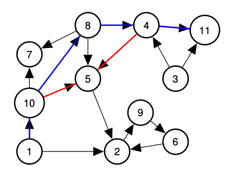

# Graphs

## Graph Concepts and Definitions.

Graph: G = (V , E)

neighbors, adjacent, degree, incident, in-degree, out-degree

<figure><figcaption></figcaption></figure>

Neighbors of 10? 1, 5, 7, 8.

u is neighbor of v if {u, v }∈E.

Edge {10, 5} is incident to vertex 10 and vertex 5.

Edge {u, v }is incident to u and v.

Degree of vertex 1? 2

Degree of vertex u is number of incident edges.

Equals number of neighbors in simple graph.

Directed graph?

In-degree of 10? 1 Out-degree of 10? 3

## Quick Proof.

The sum of the vertex degrees is equal to

(A) the total number of vertices, |V |.

(B) the total number of edges, |E|.

How many incidences does each edge contribute? 2.

2|E| incidences are contributed in total!

What is degree v ? incidences contributed to v !

sum of degrees is total incidences ... or 2|E|.

Thm: Sum of vertex degress is 2|E|.

## Paths, walks, cycles, tour.

<mark style="color:$info;">**A path**</mark> in a graph is a sequence of edges.

Path? {1, 10}, {8, 5}, {4, 5}? No!

Path? {1, 10}, {10, 5}, {5, 4}, {4, 11}? Yes!

Path: (v1, v2), (v2, v3), . . . (vk−1, vk ).

Quick Check! Length of path? k vertices or k−1 edges.

<mark style="color:$info;">**Cycle:**</mark> Path with v1 = vk. Length of cycle? k−1 vertices and edges!

Path is usually simple. No repeated vertex!

<mark style="color:$info;">**Walk**</mark> is sequence of edges with possible repeated vertex or edge.

<mark style="color:$info;">Tour</mark> is walk that starts and ends at the same node.

## Directed Paths.

Path: (v1, v2), (v2, v3), . . . (vk−1, vk ).

Paths, walks, cycles, tours ... are analagous to undirected now.

<figure><figcaption></figcaption></figure>

## Connectivity: undirected graph.

<figure><figcaption></figcaption></figure>

u and v are connected if there is a path (or walk) between u and v.

A connected graph is a graph where all pairs of vertices are

connected.

If one vertex x is connected to every other vertex.

Is graph connected? Yes? No?

Proof:

Any u, v : path from u to x and then from x to v is u−v walk.

May not be simple!

Either modify definition to walk.

Or cut out cycles. .

## Connected Components

<figure><figcaption></figcaption></figure>

Is graph above connected? Yes!

How about now? No!

Connected Components? {1}, {10, 7, 5, 8, 4, 3, 11}, {2, 9, 6}.

Connected component - <mark style="color:$info;">**maximal set**</mark> of connected vertices.

Quick Check: Is {10, 7, 5}a connected component? No.

## Finally..back to Euler!

<mark style="color:$info;">**An Eulerian Tour**</mark> <mark style="color:$info;"></mark><mark style="color:$info;">is a tour that visits each edge exactly once.</mark>

Theorem: Any undirected graph has an Eulerian tour if and only if all

vertices have even degree and is connected.

Proof of only if: Eulerian= ⇒ connected and all even degree.

Eulerian Tour is connected so graph is connected.

Tour enters and leaves vertex v on each visit.

Uses two incident edges per visit. Tour uses all incident edges.

Therefore v has even degree.

<figure><figcaption></figcaption></figure>

When you enter, you can leave.

For starting node, tour leaves first ....then enters at end.

Not The Hotel California.

## Finding a tour!

Proof of if: Even + connected= ⇒ Eulerian Tour.

We will give an algorithm. First by picture.

<figure><figcaption></figcaption></figure>

1\. Start walk from v (1) on “unused” edges

... till you get back to v.

<figure><figcaption></figcaption></figure>

2\. Remove tour, C.

<figure><figcaption></figcaption></figure>

3\. Let G1, . . . , Gk be connected components.

Each is touched by C: Vi ∩C ̸= φ.

Why? G was connected.

Let vi be (first) node in Gi touched by C.

Example: v1 = 1, v2 = 10, v3 = 4, v4 = 2.

4\. Recurse on G1, . . . , Gk starting from vi

<figure><figcaption></figcaption></figure>

5\. Splice together.

1,10,<mark style="color:$danger;">7,8,5,10</mark> ,8,4,<mark style="color:blue;">3,11,4</mark> 5,2,<mark style="color:orange;">6,9,2</mark> and to 1!

## Recursive/Inductive Algorithm.

1\. Take a walk from arbitrary node v , until you get back to v.

Claim: Do get back to v !

Proof of Claim: Even degree. If enter, can leave except for v.

2\. Remove cycle, C, from G.

Resulting graph may be disconnected. (Removed edges!)

Let components be G1, . . . , Gk.

Let vi be first vertex of C that is in Gi.

Why is there a vi in C?

G was connected= ⇒

a vertex in Gi must be incident to a removed edge in C.

Claim: Each vertex in each Gi has even degree and is connected.

Prf: Tour C has even incidences to any vertex v.

3\. Find tour Ti of Gi starting/ending at vi. Induction.

4\. Splice Ti into C where vi first appears in C.

Visits every edge once:

Visits edges in C exactly once.

By induction for all edges in each Gi.

## Planar graphs.

A graph that can be drawn in the plane without edge crossings.

The problem is, how to prove a graph is not a planar graph.

## Euler’s Formula.

<figure><figcaption></figcaption></figure>

<mark style="color:$info;">**Faces**</mark><mark style="color:$info;">: connected regions of the plane.</mark>

How many faces for

triangle? 2 (triangle + infinant)

complete on four vertices or K4? 4

bipartite, complete two/three or K2,3? 3

* <mark style="color:$info;">v</mark> is number of vertices
* <mark style="color:$info;">e</mark> is number of edges
* <mark style="color:$info;">f</mark> is number of faces.

<mark style="color:$info;">Euler’s Formula: Connected planar graph has v + f= e + 2.</mark>

Triangle: 3+ 2= 3+ 2!

K4: 4+ 4= 6+ 2!

K2,3: 5+ 3= 6+ 2!

Examples = 3! Proven! Not!!!!

## Euler and Polyhedron.

Greeks knew formula for convex polyhedron.

<figure><figcaption></figcaption></figure>

Faces? 6. Edges? 12. Vertices? 8.

Euler: Connected planar graph: v + f= e + 2.

8+ 6= 12+ 2.

Greeks couldn’t prove it. Induction? Remove vertice for polyhedron?

Convex Polyhedron without holes ≡Planar graphs.

Surround by sphere.

Project from point inside polytope onto sphere.

Sphere ≡Plane! Topologically.

Euler proved formula thousands of years later!

## Euler and non-planarity of K5 and K3,3

Euler: v + f= e + 2 for connected planar graph.

We consider simple graphs where v ≥3.

Consider Face edge Adjacencies.

Each face is adjacent to at least three edges.

≥3f face-edge adjacencies.

Each edge is adjacent to (at most) two faces.

≤2e face-edge adjacencies.

\= ⇒ 3f ≤2e for any planar graph. Or f ≤2

3 e.

Plug into Euler: v + 2/3 e ≥e + 2= ⇒ e ≤3v−6 (replace f with something bigger 2/3\*e)

K5 Edges? 4+ 3+ 2+ 1= 10. Vertices? 5.

10 ̸≤3(5)−6= 9.= ⇒ K5 is not planar.


How do you prove there is no drawing?

1, Prove a property what a planar drawing look like

2, And you can use that to argue that if the drawing does not apply to this property;

3, Then you can conclude that drawings like K5 is not planar.


## Proving non-planarity for K3,3

<figure><figcaption></figcaption></figure>

* Counter from the bottom verteces, 3 + 3 + 3 = 9 edges.
* 6 verteces

Euler’s formula= ⇒ 3f ≤2e for any planar graph.

K3,3? Edges? 9. Vertices. 6.

9 ≤3(6)−6? Sure!

<mark style="color:$danger;">Proof doesn’t work. Let’s fix this.</mark>

In a planar face, each face corresponds to a cycle.

But no cycles that are triangles. Face is of length ≥4.

Because all cycles are even length; bipartite or edges only go

between two groups.

.... 4f ≤2e for any bipartite planar graph.

Euler: v + 1

2 e ≥e + 2= ⇒ e ≤2v−4 for bipartite planar graph

9 ̸≤2(6)−4.= ⇒ K3,3 is not planar!

## Oh my goodness..what have we done!

Graphs.

Basics.

Connectivity.

Algorithm for Eulerian Tour.

Planar Graphs.

Euler’s formula.

Non-planarity of K5 and K3,3.

Next Time: prove Euler’s formula.

